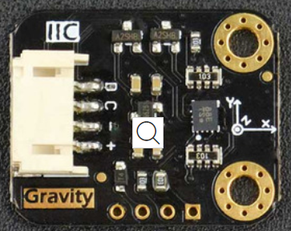

# DFRobot_BMI160

* [中文](./README_CN.md)

The BMI160 is a highly integrated, low power inertial measurement unit (IMU) that provides precise acceleration and angular rate (gyroscopic) measurement.<br>
The BMI160 contains 16 bit digtial,triaxial accelerometer and 16 bit digital, triaxial gyroscope.<br>
This example is for BMI160 sensor and it oprated via Arduino I2C.<br>



## Product Link（[https://www.dfrobot.com/product-1716.html](https://www.dfrobot.com/product-1716.html)）
    SKU: SEN0250  
   
## Table of Contents

* [Summary](#summary)
* [Connected](#connected)
* [Installation](#installation)
* [Methods](#methods)
* [Compatibility](#compatibility)
* [History](#history)
* [Credits](#credits)

## Summary
This is a 6-axis MEMS sensor BMI160 library. It can only support IIC communication.<br>
It can detect accelerometer, gyroscope, and onboard temperature.<br>

## Connected


| Sensor      |                          raspberry pi                     |
|------------ |:---------------------------------------------------------:|
|  +           | 3V3/VCC                                                   |
|  -           | GND                                                       |
|  C           | connected to scl of MCU's IIC                             |
|  D           | connected to sda of MCU's IIC                             |
|  INT1        | connected to the external interrupt IO pin of MCU         |
|  INT2        | connected to the external interrupt IO pin of MCU         |
|  SDO         | connected to the IO pin of MCU or connected to GND or VCC |

## Installation
1. To use this library, first download the library file<br>
```python
sudo git clone https://github.com/DFRobot/DFRobot_BMI160
```
2. Open and run the routine. To execute a routine demo_x.py, enter python demo_x.py in the command line. For example, to execute the demo_sleep.py routine, you need to enter :<br>

```python
python demo_sleep.py 
or
python2 demo_sleep.py 
or
python3 demo_sleep.py
```


## Methods

```python 
  '''
    @brief The constructor of the BMI160 sensor using IIC communication.
    @param addr:  7-bit IIC address, controlled by SDO pin.
    @n     BMI160_IIC_ADDR_SDO_H or 0x69:  SDO pull high.(default)
    @n     BMI160_IIC_ADDR_SDO_L or 0x68:  SDO pull down.
  '''
  class DFRobot_BMI160_IIC(DFRobot_BMI160):
  def __init__(self,addr = BMI160_IIC_ADDR_SDO_H):
  
  '''
    @brief 初始化传感器
    @return 错误代码:
    BMI160_OK                         or  0 : 初始化成功，无错误
    BMI160_E_NULL_PTR                 or -1 : 参数为空
    BMI160_E_COM_FAIL                 or -2 : 交互失败
    BMI160_E_DEV_NOT_FOUND            or -3 : 设备未连接
    BMI160_E_OUT_OF_RANGE             or -4 : 量程超出传感器范围
    BMI160_E_INVALID_INPUT            or -5 : 无效的输入
    BMI160_E_ACCEL_ODR_BW_INVALID     or -6 : 加速度数据输出速率无效
    BMI160_E_GYRO_ODR_BW_INVALID      or -7 : 陀螺仪数据输出速率无效
    BMI160_E_LWP_PRE_FLTR_INT_INVALID or -8 : 低功耗中断滤波器无效
    BMI160_E_LWP_PRE_FLTR_INVALID     or -9 : 低功耗滤波器无效
    BMI160_FOC_FAILURE                or -11: 晶振失败
  '''
  def begin(self, mode = 0):
  
  '''
    @brief 配置中断引脚
    @param intNum: 传感器的INT引脚，INT1或INT2:
    @n     1 : 传感器的INT1引脚
    @n     2 : 传感器的INT2引脚
    @return 错误代码:
    BMI160_OK     or  0 : 配置成功
    others value        : 配置失败
  '''
  def set_int(self, intNum):
  
  '''
    @brief 设置计步模式
    @param model: 模式类型
    @n     step_normal_power_mode:  普通模式下计步
    @n     step_lower_power_mode :  低功耗模式下计步
    @return 错误代码:
    BMI160_OK     or  0 : 设置成功
    others value        : 设置失败
  '''
  def set_step_power_mode(self, model):
  
  '''
    @brief 软件复位，复位后
    @param model: 模式类型
    @n     step_normal_power_mode:  普通模式下计步
    @n     step_lower_power_mode :  低功耗模式下计步
    @return 错误代码:
    @n      BMI160_OK     or  0 : 软件复位成功
    @n      others value        : 软件复位失败
  '''
  def soft_reset(self):
  
  '''
    @brief 获取传感器数据，包括陀螺仪和加速度等数据
    @return 返回字典类型的数据，格式如下：
    @n      {'accel':{'x':0, 'y':0, 'z':0}, 'gyro':{'x':0, 'y':0, 'z':0}}
    @n 注意，这是原始数据，得到正确数据还需要处理：
    @n   陀螺仪： 陀螺仪的每轴数据需要*3.14/180.0，计算后，单位rad/s
    @n   加速度： 加速度的每轴数据需要//16384.0, 计算后，单位g
  '''
  def get_sensor_data(self):
  
  '''
    @brief 获取加速度数据
    @return 返回字典类型的数据，格式如下：
    @n      {'accel':{'x':0, 'y':0, 'z':0}}
    @n 注意，这是原始数据，得到正确数据还需要处理：
    @n   加速度： 加速度的每轴数据需要//16384.0, 计算后，单位g
  '''
  def get_accel_data(self):
  
  '''
    @brief 获取陀螺仪数据
    @return 返回字典类型的数据，格式如下：
    @n      {'gyro':{'x':0, 'y':0, 'z':0}}
    @n 注意，这是原始数据，得到正确数据还需要处理：
    @n   陀螺仪： 陀螺仪的每轴数据需要*3.14/180.0，计算后，单位rad/s
  '''
  def get_gyro_data(self):
  
  '''
    @brief 设置计步计数
    @return 错误代码:
    @n      BMI160_OK     or  0 : 设置成功
    @n      others value        : 设置失败
  '''
  def set_step_counter(self):
  
  '''
    @brief 读取计步计数数据
    @return 字典类型数据， 格式为错误代码+当前的计步数据:
    @n      {'error':0, 'step':0}
    @n 注意： 当'error'的值为BMI160_OK时，表示'step'为有效数据，否则为无效数据
  '''
  def read_step_counter(self):
```

## Compatibility

| 主板         | 通过 | 未通过 | 未测试 | 备注 |
| ------------ | :--: | :----: | :----: | :--: |
| RaspberryPi2 |      |        |   √    |      |
| RaspberryPi3 |      |        |   √    |      |
| RaspberryPi4 |  √   |        |        |      |

* Python 版本

| Python  | 通过 | 未通过 | 未测试 | 备注 |
| ------- | :--: | :----: | :----: | ---- |
| Python2 |  √   |        |        |      |
| Python3 |  √   |        |        |      |

## History

- 2021-06-11 - Version 1.0.0 released.s

## Credits

Written by Arya(xue.peng@dfrobot.com), 2021. (Welcome to our [website](https://www.dfrobot.com/))


